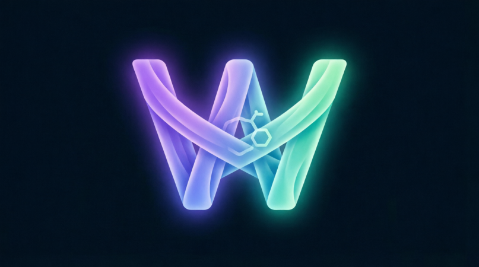

# 🚀 Weaver

**Privacy-first crypto intelligence terminal with AI insights — no backend required.**


> **Live demo:** https://ibis01.github.io/weaver/

<p align="center">
  
</p>

---

## 📸 Screenshots

<p align="center">
  
  
</p>
<p align="center">
  
  
</p>

---

## ✨ Features

### Core

- **📊 Dashboard** — Total balance, 24h/7d/all-time P/L, allocation chart, market tape
- **💼 Portfolio** — Holdings CRUD, buy/sell transactions, transaction history
- **⭐ Watchlist** — Track your favorite coins with real-time prices
- **🔍 Coin Explorer** — Search coins, detailed charts, stats, contract addresses
- **🚨 Alerts** — Price alerts, % move alerts, volume spikes + browser notifications
- **📰 News** — RSS feeds with AI sentiment, fallback snapshot
- **📈 Market** — Fear & Greed, BTC dominance, heatmap, altcoin season index, top gainers/losers

### Intelligence

- **🧠 AI Portfolio Intelligence** — Risk decomposition, pattern detection, proactive insights
- **🧠 Smart Money Tracker** — Analyze top holders, P/L reconstruction, accumulation detection
- **🐋 Whale Tracker** — Multi-chain whale wallet tracking (BTC, ETH, BSC, Polygon, Solana, Arbitrum, Avalanche)
- **🛡️ Token Shield** — Contract security auditor (honeypot, mintable, proxy, tax detection)

### Opportunities

- **💎 Gem Agent** — Autonomous new-token hunter with scoring algorithm
- **🪂 Airdrop Hunter** — Track and complete airdrop tasks
- **🏦 DeFi Tracker** — Manual DeFi position tracking
- **🔓 Token Unlocks** — Vesting cliffs & emissions calendar with sell-pressure scoring

### Tools

- **🧮 Portfolio Optimizer** — Target allocations → exact trade plan with risk analysis
- **⚡ Trading Assistant** — RSI/SMA/momentum/Fear&Greed signal engine
- **⏳ Time Machine** — Replay your portfolio's historical performance

### Research

- **📚 Learn** — Comprehensive crypto & Web3 education (16+ lessons with quizzes)
- **📰 News** — Curated crypto news with AI brief

### Account

- **👤 Profile** — Achievements, learning streak, stats
- **⚙️ Settings** — Currency, auto-refresh, AI API, Telegram alerts
- **☁️ Sync** — Zero-knowledge E2E encryption (PBKDF2 + AES-256-GCM)

---

## 🏁 Quick Start

```bash
# Clone the repository
git clone https://github.com/ibis01/weaver.git
cd weaver

# Install proxy dependencies (for news and API fallbacks)
npm install

# Start the local proxy server (for news RSS feeds)
node proxy-server.js

# Serve the app (choose one)
python3 -m http.server 8000
# OR
npx serve
```
